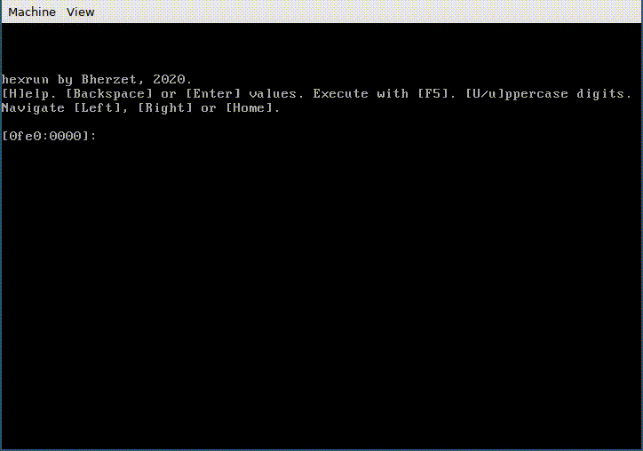

# Introduction

`hexrun` is a simple standalone, bootable program that fits into a single 512 bytes long sector of a floppy disk or a flash drive and allows you to do... well, anything. Assuming you know some machine code, that is.

# Manual

`hexrun` is actually a hexadecimal editor which, once booted, allows you to edit the entire memory segment `0x0fe0`: the logical addresses between `0xfe00` and `0x1fdff` are all yours!

## Entering values

The program displays the current address (both segment and offset part) as a hexadecimal number and expects a hexadecimal number (0 - 255) on its input. It won't allow you to enter a character that doesn't represent a hexadecimal digit, or more than 2 digits. Where relevant, both uppercase and lowercase letters (A-F, a-f) are accepted.

While typing the value, you can use Backspace to remove the last character.

Pressing Enter *doesn't* store the value, but simply moves you to the next offset. Values are stored as they are typed. If no digits were typed, the value remains unchanged. When entering new values, *always* type two digits: otherwise the first (and only) digit will be interpreted as (hexa)decimals, yielding '30' instead of '3'.

## Moving around

Pressing the left arrow key brings you to the previous offset, while the right arrow key brings you to the next offset. Overflows are not handled, so pressing the left arrow key on offset `0` will bring you to the offset `0xffff` and pressing the right arrow key will bring you back.

When using arrow keys, the current value stored at that particular address is shown. As mentioned, values are stored as they are typed, so there's no need to press Enter to store them. Pressing the arrow key again thus keeps the current value.

Pressing the Home key always brings you to the offset `0` and also displays the current value.

## Configuration

The segment to which the output is written cannot be changed.

Pressing the uppercase U configures the program to use uppercase digits (ABCDEF). Lowercase U goes back to the default setting, which is to use lowercase digits (abcdef).

## Executing the blob

Pressing F5 jumps to the address `0x0fe0:0x0000`, which is the initial address program prompts you with. Once used, computer must be rebooted to get back into the editor (which loses all the data), unless the executed program allows for return.

The initial environment of your program (the settings of flags/registers) can be observed by examining the hexrun's source code.

## Need help?

If you forget the options, pressing an uppercase H will print a short help, which is also shown on the program start.

# Installing on a flash drive or a floppy disk
The program must be installed on the first sector in order to be bootable. Standard utilities such `dd` can be used. For example, assuming `/dev/sdc` is the flash drive:

    dd if=hexrun.com of=/dev/sdc

# Getting started

Entering the following values and pressing F5 will clear the screen and print an uppercase 'A': `B8, 03, 00, CD, 10, B8, 41, 0E, CD, 10, F4`. It's an equivalent of the following assembly code:

    mov ax, 3
    int 0x10

    mov ax, 0x0e41
    int 0x10

    hlt

How far can *you* get?

# Interesting facts

I didn't code in assembly for a very long time and I'm sure the program could be written in a much more compact form. As it is, the program (without the final `times 510 - ($ - $$) hlt` to make it 512 bytes long; otherwise the boot signature would be misplaced and it wouldn't boot) compiles to 510 bytes – there're just two bytes of a "free space". If it was only three bytes longer, it wouldn't work without first loading the following sector into the memory.

This README is 3 784 bytes long.
